##  System Architecture

The system consists of a cluster of independent nodes communicating via gRPC. Each node maintains its own RocksDB instance for persistence.


##  Request Workflow (Log Replication)

The following sequence demonstrates how a write request (`SET`) is replicated and committed to ensure fault tolerance.


##  Leader Election Workflow

This diagram shows what happens when the Leader crashes and a Follower takes over.

**The Story:**

1. **Leader Dies:** Node 1 stops sending heartbeats.
2. **Timeout:** Node 2 waits (randomized 150-300ms) and gets no signal.
3. **Candidacy:** Node 2 promotes itself to Candidate, increments Term, and asks for votes.
4. **Victory:** Node 3 votes for Node 2. Node 2 gets a majority (2/3) and becomes the new Leader.

```mermaid
sequenceDiagram
    autonumber
    participant OldLeader as Node 1 (Crashed)
    participant Candidate as Node 2 (Candidate)
    participant Follower as Node 3 (Follower)

    Note over OldLeader, Follower: Normal Operation
    OldLeader->>Candidate: Heartbeat (Term N)
    OldLeader->>Follower: Heartbeat (Term N)
    
    Note over OldLeader: ☠️ CRASH! (Stops sending)
    
    Note over Candidate: Election Timeout (No Heartbeat)
    Candidate->>Candidate: Role = Candidate
    Candidate->>Candidate: Term = N + 1
    Candidate->>Candidate: Vote for Self
    
    Note over Candidate, Follower: Request Votes
    Candidate->>Follower: RequestVote RPC (Term N+1)
    
    activate Follower
    Note over Follower: Checks Term & Log
    Follower-->>Candidate: VoteGranted = True
    deactivate Follower

    Note over Candidate: Count Votes (2/3 Majority)
    Candidate->>Candidate: Role = Leader
    
    Note over Candidate, Follower: Assert Authority
    Candidate->>Follower: Heartbeat (I am Leader)
    Candidate->>OldLeader: (Network Fail - Old Leader is dead)

```



---

##  Crash Recovery Workflow

This diagram shows exactly how  `Storage` module (RocksDB) saves the day when a node restarts.

**The Story:**

1. **Crash:** Node 2 (Follower) turns off.
2. **Restart:** You run `cargo run...`.
3. **Disk Load:** The node reads `current_term` and `voted_for` from the `current` and `MANIFEST` files in RocksDB.
4. **Rejoin:** It rejoins as a Follower. It doesn't need to re-download the whole history because the Logs are still on disk!

```mermaid
sequenceDiagram
    autonumber
    participant Leader as Node 1 (Leader)
    participant Node2 as Node 2 (Crashed)
    participant Disk as Node 2 Disk (RocksDB)

    Note over Node2: ☠️ SYSTEM CRASH
    
    Note over Leader: Leader continues working...
    Leader->>Leader: Log Index = 100
    
    Note over Node2: 🔄 RESTART (cargo run)
    activate Node2
    Node2->>Disk: Load "current_term"
    Disk-->>Node2: Term = 5
    Node2->>Disk: Load "voted_for"
    Disk-->>Node2: VotedFor = None
    
    Note over Node2: state.last_log_index = 90
    Note over Node2: (I am behind by 10 logs)
    
    Node2->>Leader: (Connects to Cluster)
    deactivate Node2

    Note over Leader, Node2: Sync Missing Data
    Leader->>Node2: AppendEntries (PrevIndex=90, Entries=[91..100])
    activate Node2
    Node2->>Disk: Write Logs 91-100
    Disk-->>Node2: Success
    Node2-->>Leader: Success (Synced)
    deactivate Node2
    
    Note over Node2: 🟢 Fully Recovered

```



## 🚀 Key Features

* **Raft Consensus:** Implements Leader Election and Log Replication to handle network partitions and node failures.
* **Persistence:** Uses **RocksDB** for durable storage. The system survives total power loss and restarts.
* **Strong Consistency:** Guarantees linearizable reads and writes by routing requests through the elected Leader.
* **gRPC Communication:** High-performance inter-node communication using **Tonic** and **Protobuf**.
* **Binary Support:** Efficiently handles binary data, supporting image and file storage.

## 🛠️ Tech Stack

* **Language:** Rust
* **RPC Framework:** Tonic (gRPC)
* **Async Runtime:** Tokio
* **Storage Engine:** RocksDB
* **Serialization:** Prost (Protobuf)
* **CLI:** Clap

## 📦 Getting Started

### Prerequisites

* Rust & Cargo (`rustup`)
* Protobuf Compiler (`protoc`)
* LLVM/Clang (Required for RocksDB bindings)

### Installation

```bash
# Clone the repository
git clone [https://github.com/YOUR_USERNAME/rusty-kv.git](https://github.com/YOUR_USERNAME/rusty-kv.git)
cd rusty-kv

# Build the project
cargo build --release

```

## 🏃 Usage

### 1. Start the Cluster

Run three separate terminal instances to create a local 3-node cluster.

**Node 1 (Leader Candidate):**

```bash
cargo run --bin server -- --port 50051 --peers [http://127.0.0.1:50052](http://127.0.0.1:50052),[http://127.0.0.1:50053](http://127.0.0.1:50053)

```

**Node 2:**

```bash
cargo run --bin server -- --port 50052 --peers [http://127.0.0.1:50051](http://127.0.0.1:50051),[http://127.0.0.1:50053](http://127.0.0.1:50053)

```

**Node 3:**

```bash
cargo run --bin server -- --port 50053 --peers [http://127.0.0.1:50051](http://127.0.0.1:50051),[http://127.0.0.1:50052](http://127.0.0.1:50052)

```

### 2. Client Operations

Use the client CLI to interact with the cluster. Ensure you connect to the current Leader's port (usually 50051 initially).

**Set a Value:**

```bash
cargo run --bin client -- --addr [http://127.0.0.1:50051](http://127.0.0.1:50051) set my_key "Hello World"

```

**Get a Value:**

```bash
cargo run --bin client -- --addr [http://127.0.0.1:50051](http://127.0.0.1:50051) get my_key

```

**Upload/Download Binary Files:**

```bash
# Upload an image
cargo run --bin client -- --addr [http://127.0.0.1:50051](http://127.0.0.1:50051) upload profile_pic ./avatar.png

# Download the image (verifies data integrity)
cargo run --bin client -- --addr [http://127.0.0.1:50051](http://127.0.0.1:50051) download profile_pic ./restored_avatar.png

```

## 🧪 Fault Tolerance Demo

To verify the system's resilience:

1. **Write Data:** Upload a file to the Leader.
2. **Simulate Crash:** Kill **all** terminal processes (`Ctrl+C`).
3. **Recover:** Restart the cluster terminals.
4. **Verify:** Use the client to download the file from a **Follower** node. The data will remain available and consistent.

## 📂 Project Structure

* `common/`: Shared Protobuf definitions (`kv.proto`) and data structures.
* `server/`: Core Raft implementation.
* `main.rs`: Election logic, Heartbeats, and RPC handlers.
* `storage.rs`: RocksDB wrapper for WAL and State Machine.


* `client/`: CLI tool for testing and interaction.

## 📄 License

This project is licensed under the MIT License.


